# Pet-BnB

## Code/Technology Requirements

#### Problem Definition

Going on holidays or arranging business travels is extremely difficult when you have pets.
Ideally, pet-owners would like to bring their furry friends with them, but pet-friendly facilities are still not too common and those who do allow pets, frequently offer ridicolously over-charged prices. The same scenarios applies to transportation; very few airline companies accept pets and, those who do, provide such service only as a luxury/premium option or by boarding animal in the cargo hold of aircrafts. On top of this, some limitations still applies to specific race/breeds (e.g. short-nosed canine breeds are normally not allowed).

As sad as it might sound, the second most logical option would be to depart without your companion and to rely on Pet Accomodations/Boarding facilities. Generally speaking, those structures claim to have highly qualified staff to look after/entertain your pet and often 24/7 on-site vets. In the best case scenario, the offered services are as good as described but they cost a fortune. In the worse case scenario, the "qualitied staff" who are supposed to keep company to your animal do their job without passion and your pet might end up being kept in small cages for the whole period.

The easist and cheapest option is to reach out to private pet-sitters, who do what they do for passion, sometimes as a hobby or a as a second job, simply because they cannot have (or cannot commit to have) a pet their self. But how would you look for a pet sitter? Probably among your close circle of friends and family. Or also by asking them if the happen to know anyone who might be keen. Which is a very limited pool of people and, as a consequence, it's unlikely to have a chance to decide between more than one pet-sitter.

#### Solution

Here is where my project comes into play; I am creating an online web portal where pet-sitters can advertise theirself, their availability and which services they are keep to do. Pet-owners can browse those pet-sitter profiles, place a booking and eventually paying for those services.

#### Live Web App

[pet-bnb-demo.herokuapp.com](https://pet-bnb-demo.herokuapp.com)

#### Repository

[github.com/ironest/Pet-BnB](https://github.com/ironest/Pet-BnB)

#### Functionality / features

My marketplace project allows users to:
* Register a new account
* Create their profile (firstname, lastname, profile picture)
* Create their pet's profile (name, breed, size, pet picture)
* Upgrade a standard profile to a Pet-sitter profile (adding availability, services offered and daily fee prices)
* Place bookings (in 3 phases)
  * phase 1 - expression of interest
  * phase 2 - request acceptance (or rejection)
  * phase 3 - completion (payment)

#### Sitemap

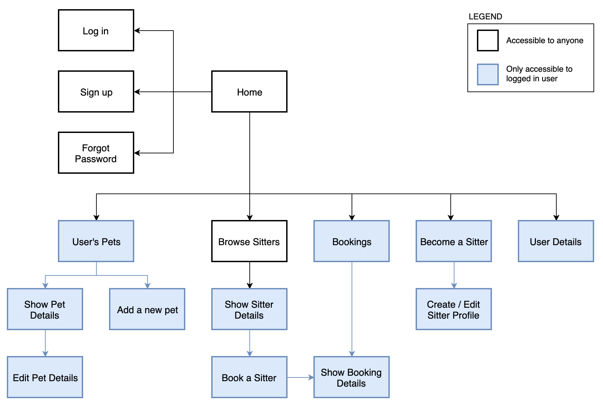

#### Screenshots

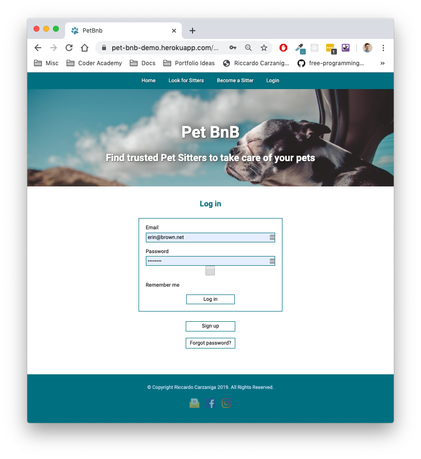 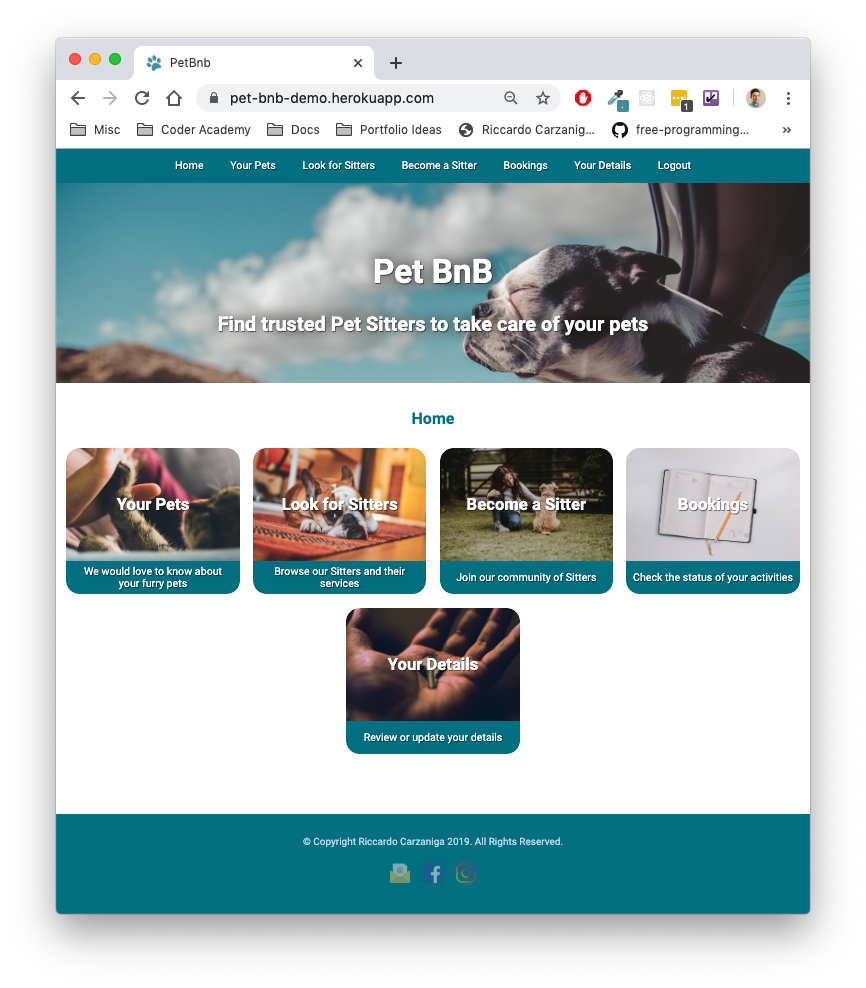 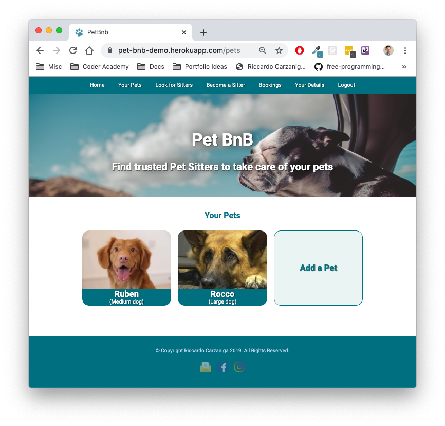 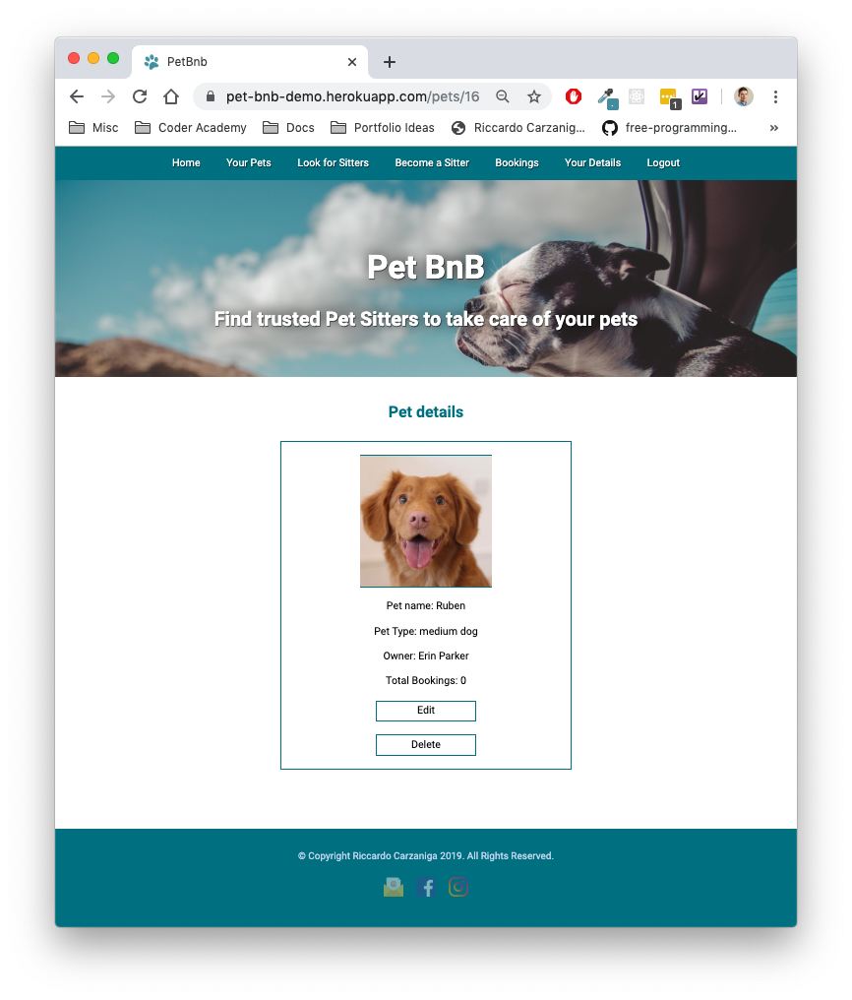 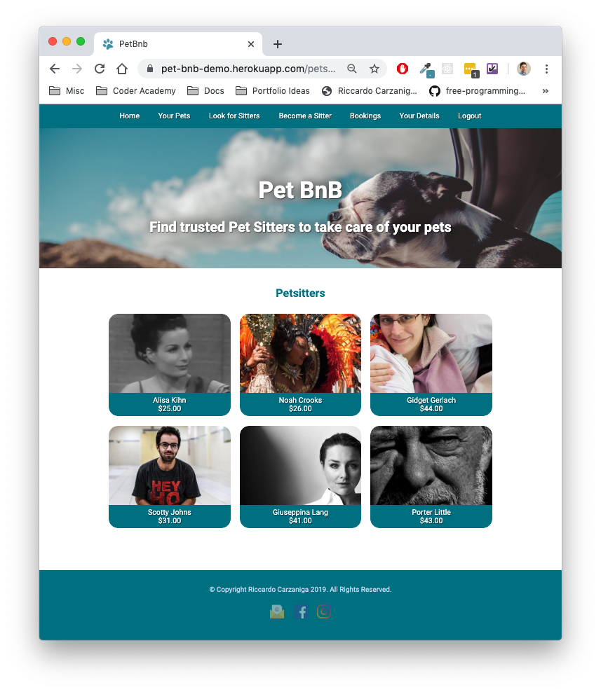  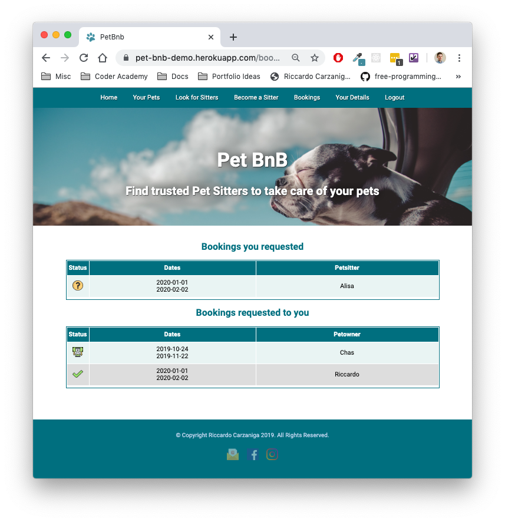

#### Target audience

The target audience for my project can be broken-down into the main categories:
* People who have pets and are looking to join a centralized place where to find petsitters.
* People who are willing to offer services such as:
  * Pet Sitting At Sitter home
  * Pet Sitting at Pet’s home
  * Pet Walking
  * Pet Grooming
  * Pet Training

#### Tech stack

* Frontend
  * HTML
  * CSS
  * Javascript
* Backend:
  * Ruby (version 2.6.3)
  * Rails (version 5.2.3)
  * Postgresql (version 11.5)
* Deployment platform
  * Heroku (as web-app hosting platform)

#### Third party services

* **Faker**

Faker is a Ruby Gem to generate random data. It is composed by many modules, each responsible for different subjects. In my web-app, I relied on Faker during the testing phase, to seed fake data into my PostgreSQL database.
Modules I took advantage of are:
  * Faker::Name
  To generate customer firstname/lastname
  * Faker::Internet
  To generate customer contact detail
  * Faker::LoremFlickr
  To generate customer and pet profile pictures
  * Faker::Creature
  To generate pet information detail
  * Faker::Date
  To generate Customers DoB and Booking periods

* **Loremflickr**

LoremFlickr provides placeholder images for every case on almost any subject, in any size. It is also possible to specify one (or more) keywords to get an image displaying the subject requested. I used this service as part of my automated seeding process, by retrieving Pets and User profile pictures. However, this service was not directly employed by my own code, by rather through Faker which exposes a module and a method to call Loremflickr.

* **Down**

Down is a utility tool for streaming, flexible and safe downloading of remote files.
For my web-app, I used the Down's primary method `Down.download`, which downloads the remote file into a temporary file.
Down is employed to download and store images (from Loremflickr) in my web-app active storage. In the early stage of the development phase, active storage was configured as local and, eventually, on AWS S3.

* **Devise**

Devise is a flexible authentication solution for Rails based on Warden.
In my web-app, Devise was used to provide the authentication feature, which translates into giving users the possibility to:
  * Sign up for an account
  * Log in into their account
  * Change their password
  * Retrieve a password (if forgotten)

  One of the greatest benefit provided by Devise (other than the obvious authentication feature) is the availability of a special object `current_user` which returns the exact active record of the current logged-in user.

* **Stripe**

Stripe is a service that allows individuals and businesses to make and receive payments over the Internet. In my web-app, this third party service was employed to provide pet-owner a way to make payments to pat-sitters. Among all the functionalities that Stripe offers, I used the "One-time payments with Checkout" option, which translates into redirecting a user to a payment form where customers can complete their purchases (by entering their credit card details). Once a customer has completed a purchase, they are redirected back to my web-app. To rely on this third party service, I used both the online Stripe web-form AND the Stripe Gem, which is required to prepare the `Stripe::Checkout::Session` and to retrieve the `Stripe::PaymentIntent` from the webhook.

* **Amazon S3**

Amazon S3 is a service offered by AWS that provides object storage through a web service interface.

* **Heroku (PaaS and DBaaS)**

Heroku is a cloud platform as a service (PaaS) supporting several programming languages. I relied on Heroku for the deployment of my Ruby on Rails application as well as for the creation/maintenance of my PostgreSql Cloud database (DBaaS).

#### User stories

**1.** As a user, I want to be able to register/sign up, so I can create my own profile

**2.** As a user, I want to be able to change my password, so I can improve security of my account

**3.** As a user (pet-owner), I want to be able to create a profile for each of my pet, so I can specify which service are required for each of my pet

**4.** As a user (pet-owner), I want to be able to edit/modify info about my pet, so I can keep up-to-date information that might change over time

**5.** As a user (pet-owner), I want to be able to browse among pet-sitter profiles, so I can choose and compare who is the most suitable for my needs

**6.** As a user (pet-owner), I want to be able to place an expression of interest for a pet-sitter, so I can notify my intention to book his/her services

**7.** As a user (pet-owner), I want to be able to specify for which period I need a pet-sitter for, so I can make sure there are no ambiguities when placing a reservation

**8.** As a user (pet-sitter), I want to be able to create an extended profile costs and services I can offer, so other users can recognise me as a pet-sitter

**9.** As a user (pet-sitter), I want to be able to specify my daily rate fees, so pet-sitter know in advance if they can afford my services

**10.** As a user (pet-sitter), I want to be able to see if a pet-sitter sent me an expression of interest, so I can accept or reject it

**11.** As a user (pet-owner), I want to be able to see if a pet-sitter accepted of rejected my expression of interest, so I can proceed with a payment and lock in the booking

#### Wireframes

Wireframes have been planned to be responsive on any possible resolutions, from the smallest iPhone5 (320px only) till wide screens, passing through intermediate resolution of iPads/tablets.
The responsiveness is provided through extensive usage of Flexbox and Media Queries.

**Login screen:**

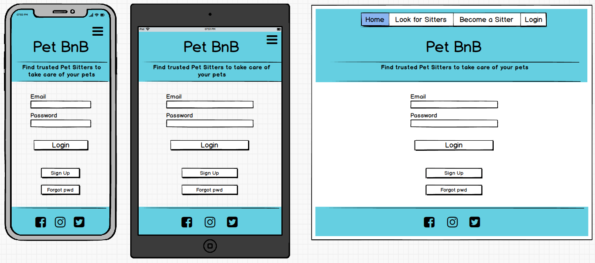

**Homepage after login:**

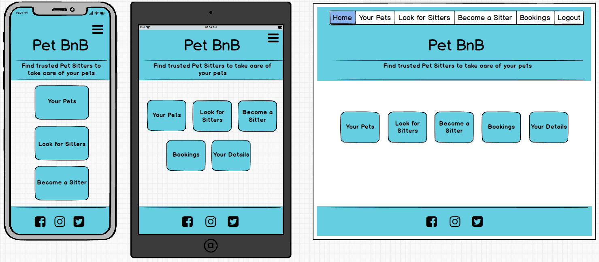

**Your Pet profiles:**

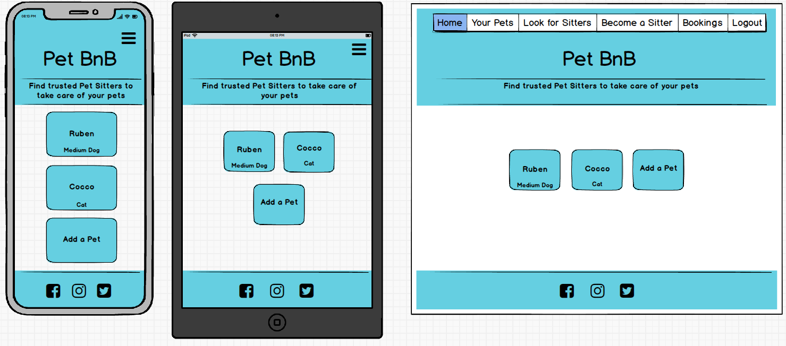

**Become a Petsitter:**

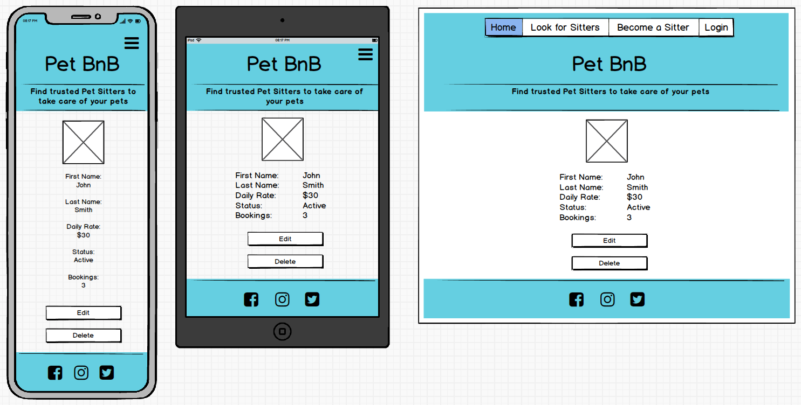

**Check your Bookings:**

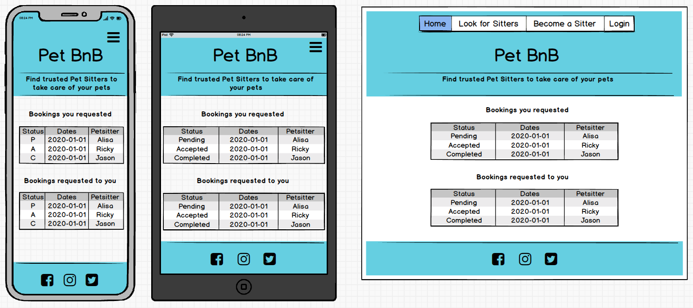

#### Entity Relationship Diagram (ERD)


#### Database Schema


#### Models relationships & Active Record associations

**Pet and User models:**
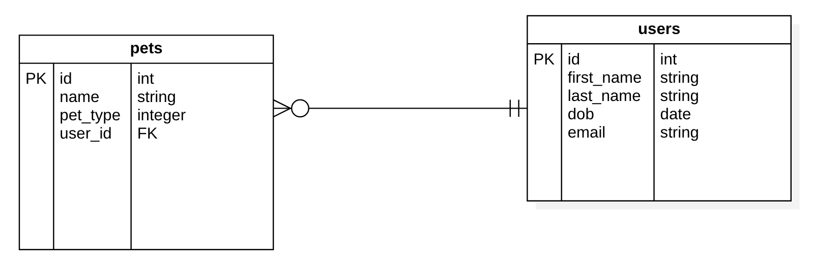
As shown in the above picture (through the crow foot), between Pet and User models there is a **zero or one-to-many** relationship, where the one single User can have **zero, one or many** Pets, while one single Pet has **one and only one** User.
 * The "zero/one" cardinality is denoted by the empty circle (on the left handside)
 * The "many" cardinality is denoted by the three finger crowfoot (on the left handside)
 * The "one and only one" cardinality is denoted by the double bar (on the right handside).

Such relationship is maintained by adding a new column on the Pet object (user_id) and storing in it the User Primary Key (id). The new attribute on the Pet table is called "Foreign Key".

In Rails, the Active Record association implemented for these two objects is:

```ruby
class Pet < ApplicationRecord
  belongs_to :user
end

class User < ApplicationRecord
  has_many :pets
end
```

**User and Petsitter models:**
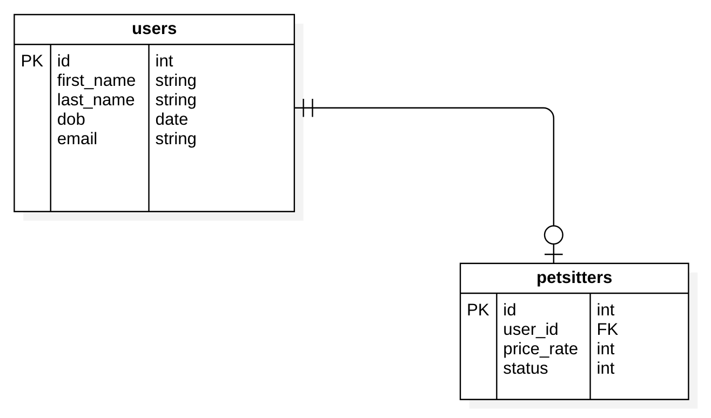
Differently from the previous paragraph, this connection describes a **one to one (or zero)** relationship, where one single user has one (or zero) petsitter records, while one single petsitter has one and only one user record. As before, to maintain such relationship, I decided to create a new column on the Petsitter table and store in it the User primary key. Such new column "user_id" is the "Foreign Key" that performs the connection.

On the Rails world, the Active Record association is implemented with:

```ruby
class User < ApplicationRecord
  has_one :petsitter
end

class Petsitter < ApplicationRecord
  belongs_to :user
end
```
**Petsitter and Service models:**
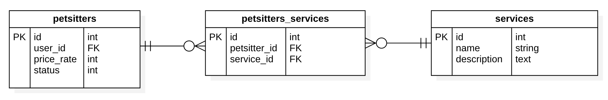

During the design of a database, it happens to stumble on cases where two objects refer to each other in a **many to many** relationship. The meaning of such connection can be described as when multiple records from one table are related to multiple records in another table. Unfortunately, such scenario cannot be implemented in a relational database and an extra object has to be created. The required 3rd object is usually referred as **joining table** or a **bridging table**. For Petsitter and Service I created an intermediate entity called Petsitters_Service, which has the important objective of resolving the previously mentioned many-to-many relationship. By applying this strategy, it's possible to create two simpler relationships, in the form of:
* One to many (Petsitter vs Petsitters_Service)
* Many to one (Petsitter_Service vs Service)

To achieve such result, the joining table has to maintain two extra column (foreign keys) which hold the reference to the primary keys of Petsitter and Service table.
On the Rails world, the Active Record association is implemented as:

```ruby
class Petsitter < ApplicationRecord
  has_many :petsitters_services
  has_many :services, through: :petsitters_services
end

class Service < ApplicationRecord
    has_many :petsitters_services
    has_many :petsitters, through: :petsitters_services
end
```
**Pet and Booking models +
User and Booking models +
Petsitter and Booking models:**

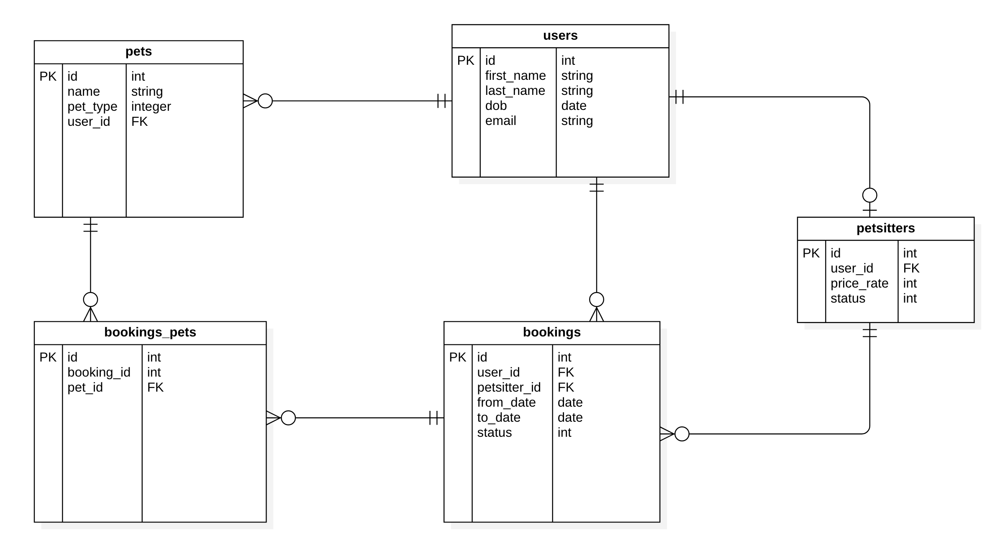

As shown in the above picture, the Booking model has many relationship with the following objects:
* User (one to many)
* Petsitter (one to many)
* Pets (many to many)

The first two relationships are implemented by simply storing inside the Booking table two foreign keys that connect to User and Petsitter tables.
The third (and more complex) relationship had to be resolved with another **joining table** named Bookings_Pet. This last table is responsible to maintain foreign keys of Pet and Booking itself.

The active record implementation is described below:
```ruby
class Pet < ApplicationRecord
  belongs_to :user
  has_many :bookings_pets, dependent: :destroy
  has_many :bookings, through: :bookings_pets
end

class User < ApplicationRecord
  has_many :pets
  has_many :bookings
  has_one :petsitter
end

class Petsitter < ApplicationRecord
  belongs_to :user
  has_many :bookings, dependent: :destroy
end

class Booking < ApplicationRecord
  belongs_to :user
  belongs_to :petsitter
  has_many :bookings_pets, dependent: :destroy
  has_many :pets, through: :bookings_pets
end

class BookingsPet < ApplicationRecord
  belongs_to :booking
  belongs_to :pet
end
```
**Active Storage:**
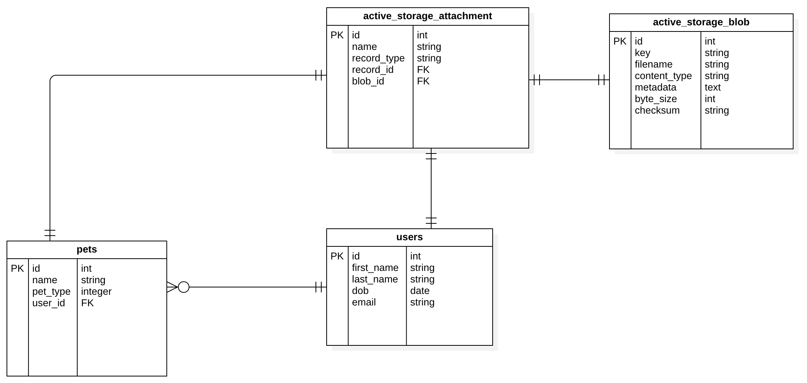

```ruby
class User < ApplicationRecord
  has_one_attached :picture
end

class Pet < ApplicationRecord
  has_one_attached :picture
end
```

#### High-level components

My Web App is build in Ruby on Rails, following the architectural pattern known as MVC, where the entire app is broken down into THREE high-level components:
* Models
* Views
* Controllers

Each of these components are built to handle specific development aspects of the application. MVC is one of the most frequently used industry-standard web development framework to create scalable and extensible projects.
The Model component represents shape of the data and business logic. It maintains the data of the application. Model objects retrieve and store model state in a database.
For maintainability and ease of access, the Model component is further browken down into several business objects:
* Users
* Services
* Petsitters
* Petsitters_services
* Pets
* Bookings
* Bookings_pets

Each of them store, retrieve and provide data for the object they represent.

The View component corresponds to the user interface. Views display data using model to the user and also enables them to modify the data.
Similarly to the Model, the View component is also broken down into sub-objects:
* Bookings
* Pets
* Petsitters
* Pages

Lastly, there's the Controller component; it handles the user request. Typically, users interact with View, which in-turn raises appropriate URL request, this request will be handled by a controller. The controller renders the appropriate view with the model data as a response.
Sub-objects of the Controllers are:
* Bookings
* Pets
* Petsitters
* Pages

#### Trello board and Tasks allocation

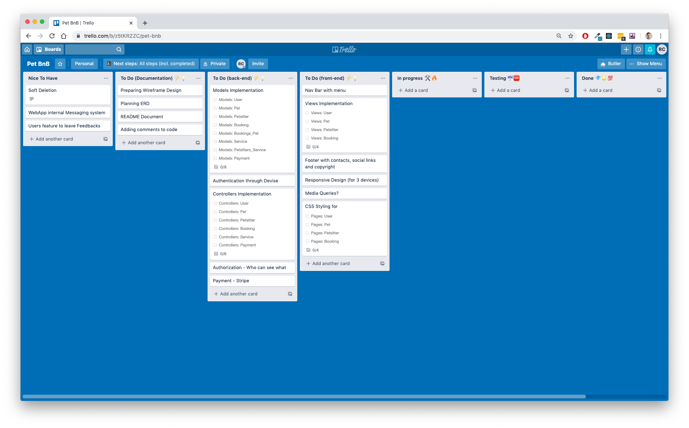

* **Day 1 (Friday 25-Oct-2019)**
  * Project idea approved
  * Wireframes sketched out
  * ERD diagram designed

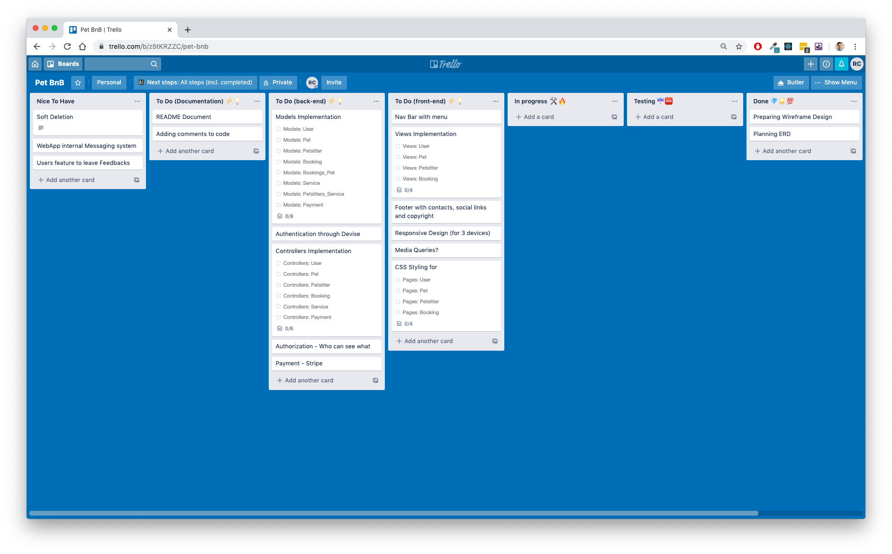

* **Day 2 (Monday 28-Oct-2019)** 
  * Created Models (excepting Payments)
  * Create Tables (excepting Payments)
  * Amended DB with Migrations
  * Applied Model reletionships

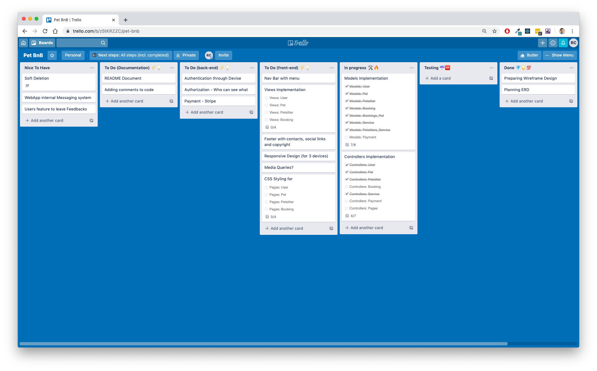

* **Day 3 (Tuesday 29-Oct-2019)** 
  * Installed Devise
  * Research and Experiment with Devise
  * Customization of User Model

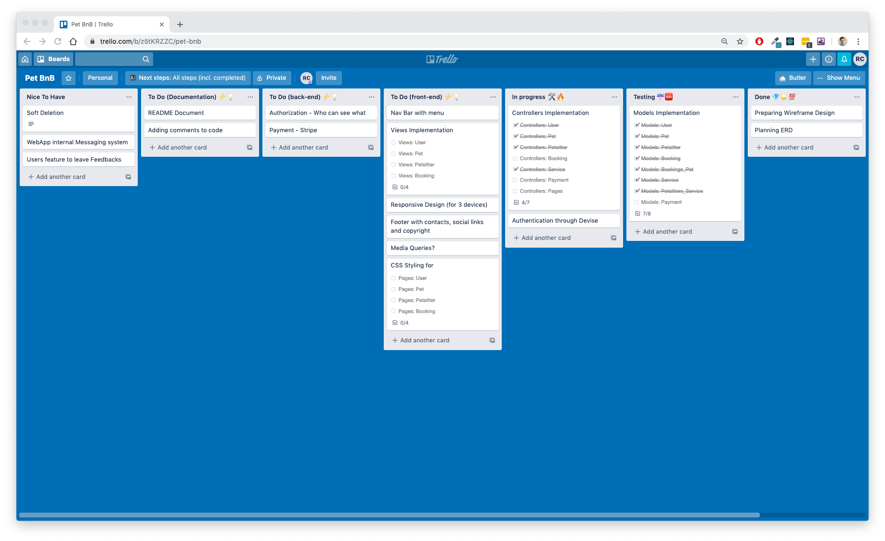

* **Day 4 (Wednesday 30-Oct-2019)** 
  * Installed Active Storage (local)
  * Configured associations between Models and Active Storage (Local Storage)

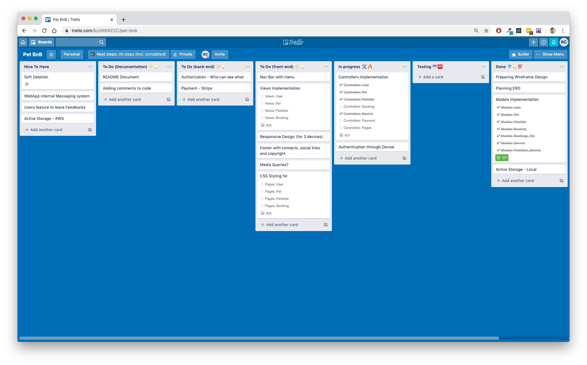

* **Day 5 (Thursday 31-Oct-2019)** 
  * Created Page Controller
  * Created Page (and shared) HTML & CSS

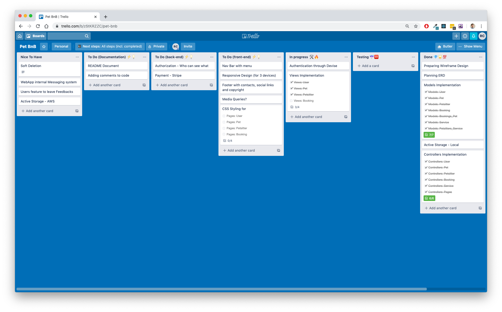

* **Day 6 (Friday 01-Nov-2019)** 
  * Entire day spent on Mobile Responsive Design 
  * Navbar design
  * Hamburger menu & Sidebar

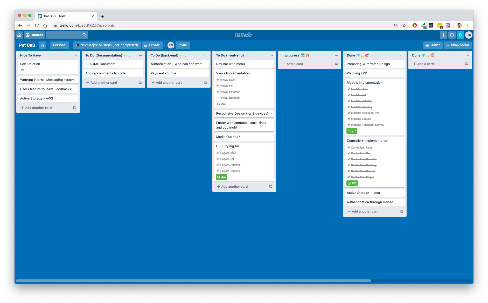

* **Day 7 (Saturday 02-Nov-2019)** 
  * Created Pet Controller
  * Created Pet HTML & CSS
  * Researched some JS for loading images

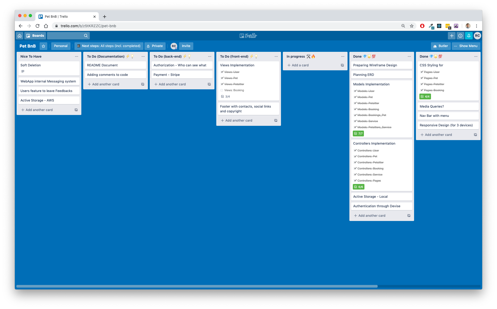

* **Day 8 (Sunday 03-Nov-2019)** 
  * Created Petsitter Controller
  * Created Petsitter HTML & CSS

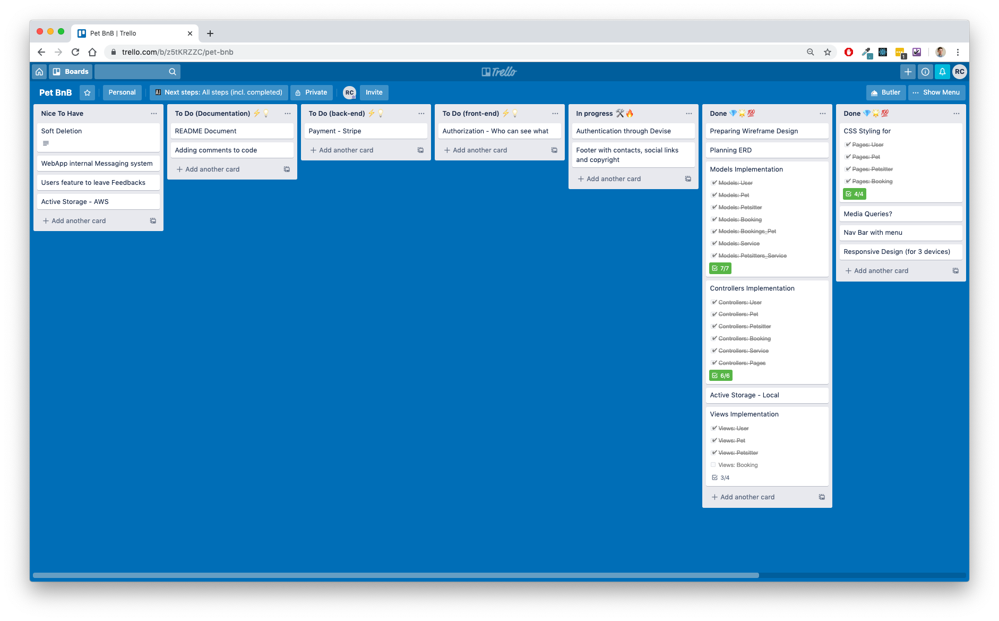

* **Day 9 (Monday 04-Nov-2019)** 
  * Modified Booking table (through migration)
  * Created Booking Controller
  * Created Booking HTML & CSS

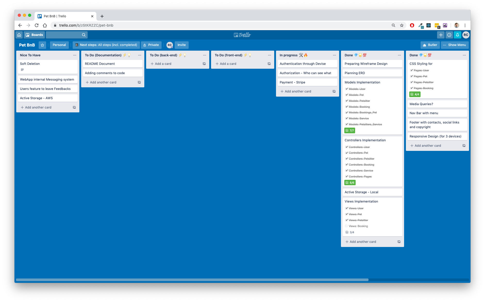

* **Day 10/11/12 (Tuesday/WednesdayThursday 05/06/07 Nov-2019)** 
  * Finalized all front-end matters
  * Responsiveness through Flexbox
  * Media queries (for max-width on breackpoints)
  * Footer with links and social media


* **Day 13/14 (Friday/Saturday 08/09 Nov-2019)** 
  * Authorization (to protect who can access what)
  * Payment through Stripe

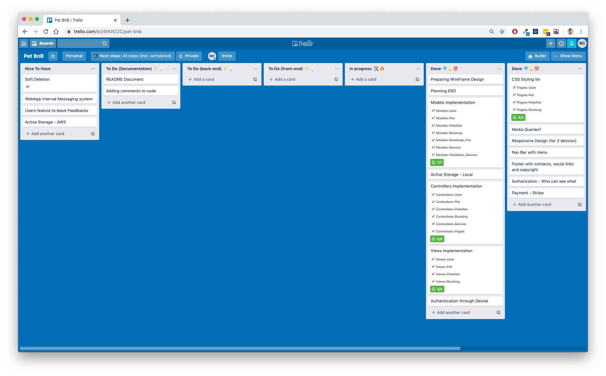

* **Day 15 (Sunday 10 Nov-2019)** 
  * Readme Document
  * Added comments to code

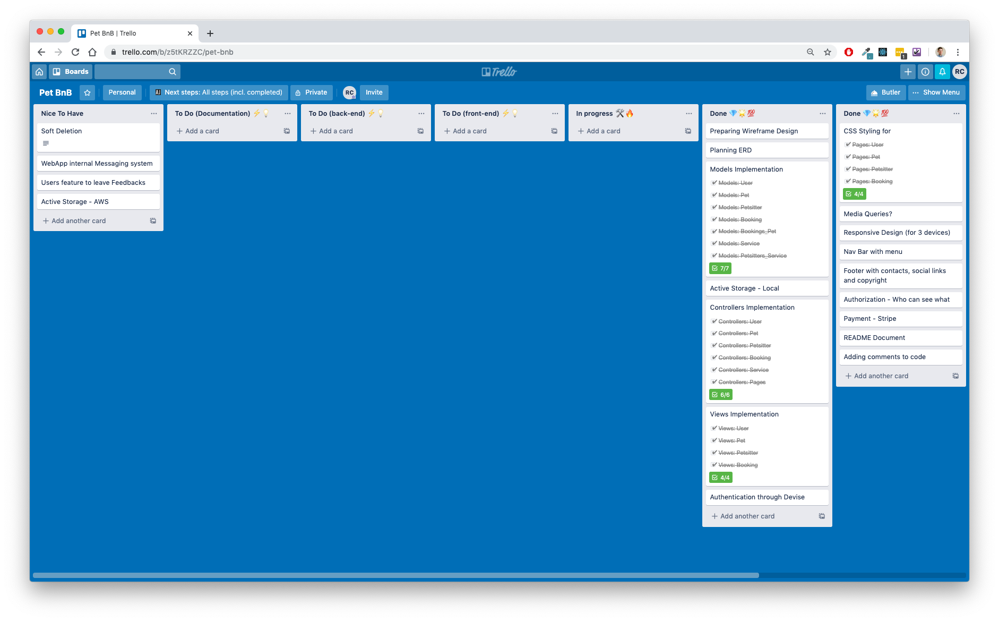